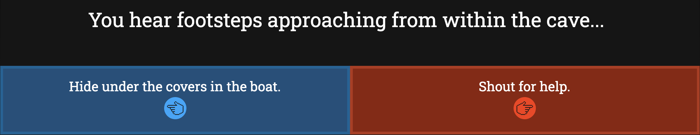

# [Helica](https://deanspooner.github.io/helica/), by [Dean Spooner](https://github.com/DeanSpooner) 

## Helica: where will you end up?

A demonstration of a "choose your own adventure" game, created in React. This game finds you wake up in a small boat, docked in a cave. Your memories? Gone.

As you explore this region, you will have to make choices that will have consequences on your progress. You will always be presented with two choices: simple, right?

### Future updates

- More storyline and choices;
- Possible use of backend system to store choices/flags, and integrate deeper overall system;
- Automatic saving to web cache;
- Player naming system;
- Inventory system;
- Map system;
- HP, damage, enemies and battling system;
- Images to enhance storytelling;
- More music/SFX;
- Favicon to be added.

### Known issues

- Sound effects play regardless of whether the player has chosen to mute the game or not.

### Version history:

- 0.3.0: Favicon added and dynamic backgrounds implemented to enhance atmosphere e.g. orange background near lanterns, blue background near the sea;
- 0.2.1: Demo expanded;
- 0.2.0: Styling updated and sound effects added;
- 0.1.0: Base system implemented.

# By [Dean Spooner](https://github.com/DeanSpooner), 2022

